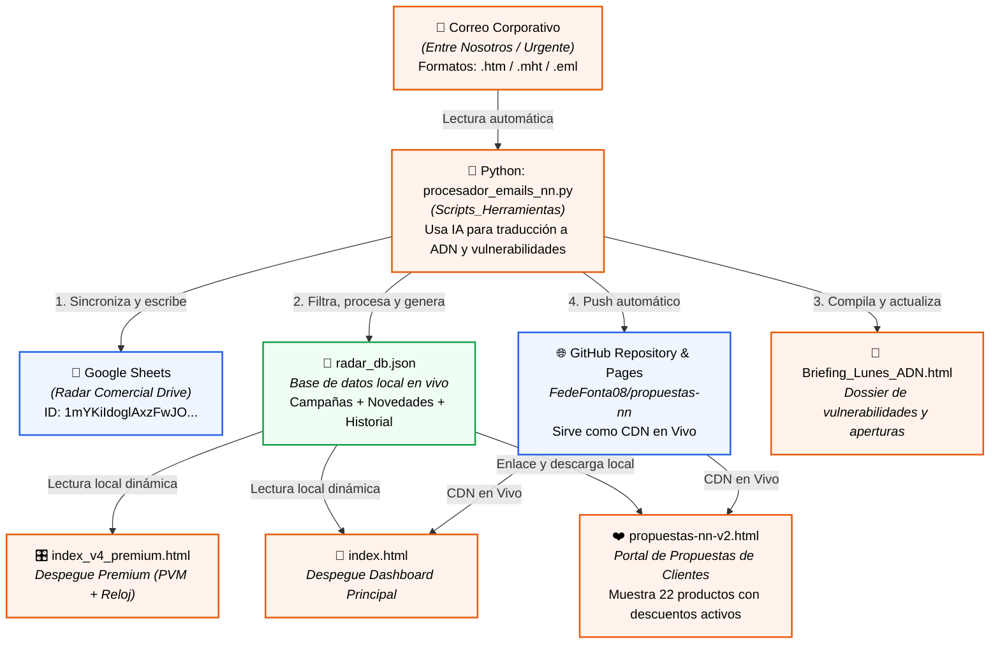

# Mapa del Ecosistema Digital NN (Fede Fontanals)

Este documento detalla la arquitectura completa de tu sistema consultivo de ventas. Ilustra cómo fluyen los datos de las campañas desde los boletines corporativos oficiales hasta tu base de datos centralizada, tus paneles de control y el portal interactivo que ven tus clientes.

---

## 📂 Directorio de Componentes e Interconexiones

### 1. Entrada de Datos y Automatización (El Cerebro)

*   **Script de Procesamiento:** [procesador_emails_nn.py](file:///D:/Users/ffont/Downloads/06_NATIONALE_NEDERLANDEN/Scripts_Herramientas/procesador_emails_nn.py)
    *   **Función:** Lee los correos de *Entre Nosotros* o *Urgente* guardados en tu carpeta de descargas. Envía el texto a Gemini para traducirlo bajo la metodología de venta consultiva (vulnerabilidades, objeciones y preguntas de apertura).
    *   **Salidas directas:**
        1.  Actualiza las filas en tu hoja de **Google Sheets** (Radar Comercial).
        2.  Limpia e inserta las novedades y campañas en tu archivo local [radar_db.json](file:///D:/Users/ffont/Downloads/06_NATIONALE_NEDERLANDEN/radar_db.json).
        3.  Genera de forma limpia tu dossier estratégico interactivo [Briefing_Lunes_ADN.html](file:///D:/Users/ffont/Downloads/06_NATIONALE_NEDERLANDEN/Briefing_Lunes_ADN.html).
        4.  Hace commit y push automático a tu repositorio en GitHub para actualizar las páginas web públicas.

### 2. Base de Datos Central (El Corazón)

*   **Archivo de Datos:** [radar_db.json](file:///D:/Users/ffont/Downloads/06_NATIONALE_NEDERLANDEN/radar_db.json)
    *   **Función:** Contiene todas las campañas activas, novedades y el historial de boletines estructurados en formato estructurado (JSON).
    *   **Interconexión:** Es la fuente de la verdad para todas las interfaces de usuario.
        *   Tanto `index.html` como `index_v4_premium.html` lo leen directamente cuando están en local.
        *   `propuestas-nn-v2.html` (portal de propuestas de clientes) lee la versión en línea a través de la CDN de GitHub para saber si hay descuentos activos aplicables a algún producto en particular.

### 3. Pantallas de Control (El Panel de Fede)

*   **Panel Despegue Estándar:** [index.html](file:///D:/Users/ffont/Downloads/06_NATIONALE_NEDERLANDEN/index.html)
    *   **Función:** Tu panel diario principal de herramientas y control de PVM.
    *   **Interconexión:** Carga la sección de Radar Comercial a través de un sistema híbrido: intenta leer primero tu `radar_db.json` local (con los nuevos filtros implementados), luego prueba el CDN de GitHub y, finalmente, conecta en vivo con Google Sheets.
*   **Panel Despegue Premium:** [index_v4_premium.html](file:///D:/Users/ffont/Downloads/06_NATIONALE_NEDERLANDEN/index_v4_premium.html)
    *   **Función:** Una versión estética y oscura optimizada para pantallas secundarias con reloj en vivo, seguimiento premium de PVM y el Radar Comercial sincronizado.
    *   **Interconexión:** Lee dinámicamente `radar_db.json` y aplica los mismos filtros anti-placeholders.
*   **Dossier de Inteligencia ADN:** [Briefing_Lunes_ADN.html](file:///D:/Users/ffont/Downloads/06_NATIONALE_NEDERLANDEN/Briefing_Lunes_ADN.html)
    *   **Función:** Guía rápida semanal que traduce cada campaña activa del Radar Comercial en la debilidad de protección real del cliente (bisturí ADN) y una pregunta de apertura pulida para iniciar llamadas de prospección.
    *   **Interconexión:** Generado directamente por la ejecución del script Python. Ahora cuenta con exclusión estricta de campañas de prueba.

### 4. Portal del Cliente (El Cierre de Ventas)

*   **Portal de Propuestas:** [propuestas-nn-v2.html](file:///D:/Users/ffont/Downloads/06_NATIONALE_NEDERLANDEN/propuestas-nn-v2.html)
    *   **Función:** Generador de enlaces comerciales dinámicos que presentas a tus prospectos. Cuenta con 22 fichas interactivas de productos de Nationale-Nederlanden organizadas en 5 fases de protección.
    *   **Interconexión:** 
        *   Recibe parámetros de URL de tus clientes para saludarlos de forma personalizada.
        *   **Carga la base de datos de Radar en vivo** desde el CDN de GitHub (`radar_db.json`). Si una campaña del Radar tiene un `id_producto` configurado y está activa, el portal inyecta automáticamente el descuento en la ficha correspondiente (ej. 25% vitalicio en *Contigo Autónomo* y *Contigo Familia*) de manera 100% interactiva.

---

> [!NOTE]
> Gracias a las correcciones de hoy, todas las páginas del sistema (`index.html`, `index_v4_premium.html` y `Briefing_Lunes_ADN.html`) han sido reforzadas para que utilicen los filtros de seguridad comunes. Cualquier placeholder de testeo o celda vacía del Google Sheet será ignorada automáticamente en todo el ecosistema.
