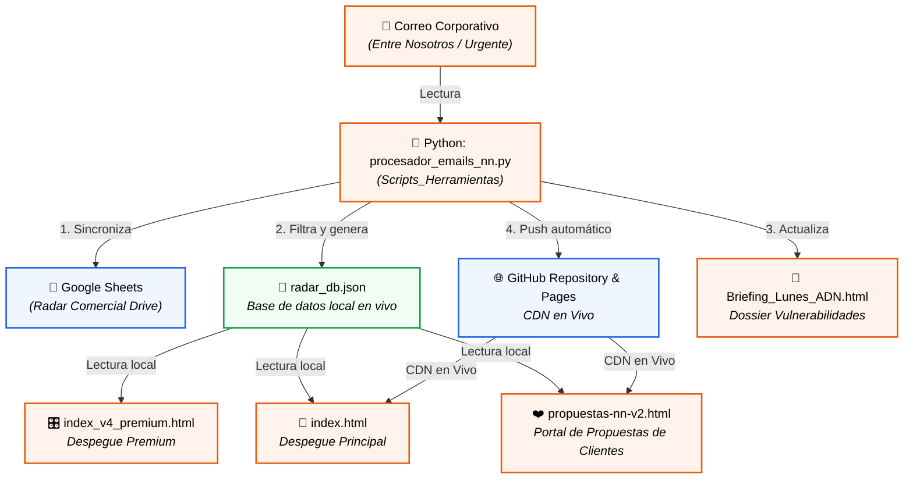

<div align="center">


# 🟠 ECOSISTEMA DESPEGUE — INTELIGENCIA COMERCIAL
### Punto Naranja Xàtiva · Alta Consultoría de Protección

[](https://fedefonta08.github.io/propuestas-nn/)
[](#)
[](#)

> *"No estamos aquí para vender. Estamos aquí para diagnosticar y blindar lo que realmente importa."*  
> — **Metodología ADN · Mayéutica Financiera**

---

### 🛡️ Partners de Confianza Institucional

<div align="center">
   &nbsp;&nbsp;&nbsp;&nbsp;&nbsp;&nbsp;
   &nbsp;&nbsp;&nbsp;&nbsp;&nbsp;&nbsp;
   &nbsp;&nbsp;&nbsp;&nbsp;&nbsp;&nbsp;
  
</div>

</div>

---

## 🧠 ¿Qué es el Ecosistema Despegue?

El **Ecosistema Despegue** es una infraestructura de **Ingeniería Comercial** diseñada para transformar la venta reactiva en una consultoría de alta autoridad. No es solo un repositorio de herramientas; es el centro de mando que integra datos en tiempo real, automatización de scripts y gestión inteligente de contactos bajo la metodología ADN.

**El objetivo es simple: Eliminar la fricción, maximizar la conversión y profesionalizar cada interacción.**

---

---

## 🛠️ Herramientas del Ecosistema

El sistema se divide en cuatro capas operativas para cubrir todo el ciclo de la venta consultiva.

### 1️⃣ Núcleo Operativo (Dashboards de Venta)
| Herramienta | Archivo | Estado | Propósito |
|-------------|---------|--------|-----------|
| 🎯 **Panel DESPEGUE** | [`index.html`](https://fedefonta08.github.io/propuestas-nn/) | 🟢 Live | Dashboard principal: PVM, Radar Comercial y acceso rápido. |
| 📡 **Sistema Aperturas Pro** | [`aperturas_desktop_v4.html`](https://fedefonta08.github.io/propuestas-nn/aperturas_desktop_v4.html) | 🟢 Live | Workflow de llamadas: 8 perfiles psicológicos y cronómetro. |
| 📞 **Cockpit de Llamadas** | [`cockpit_llamadas.html`](https://fedefonta08.github.io/propuestas-nn/cockpit_llamadas.html) | 🟢 Live | Cola de contactos por vencimiento y guion ADN dinámico. |
| 🎬 **Modo Enfoque Pro** | [`modo_enfoque_pro_v3_RGPD.html`](https://fedefonta08.github.io/propuestas-nn/modo_enfoque_pro_v3_RGPD.html) | 🟢 Live | Call scripting con objeciones accordion y sincronización CRM. |

### 2️⃣ Marketing & Captación (Generadores de Impacto)
| Herramienta | Archivo | Estado | Propósito |
|-------------|---------|--------|-----------|
| 🖼️ **Marketing Cards** | [`marketing_cards_premium.html`](https://fedefonta08.github.io/propuestas-nn/marketing_cards_premium.html) | 🟢 Live | Kit de Social Media: genera imágenes premium para WhatsApp/RRSS. |
| 📋 **Portal Propuestas v2** | [`propuestas-nn-v2.html`](https://fedefonta08.github.io/propuestas-nn/propuestas-nn-v2.html) | 🟢 Live | Landing pages personalizadas para 22 productos NN. |
| ⚙️ **Generador de URLs** | [`generador_urls_propuestas.html`](https://fedefonta08.github.io/propuestas-nn/generador_urls_propuestas.html) | 🟢 Live | Automatiza la creación de enlaces y plantillas de email. |
| 🎂 **Felicita NN** | [`Felicitaciones_Cumple_NN.html`](https://fedefonta08.github.io/propuestas-nn/Scripts_Herramientas/Felicitaciones_Cumple_NN.html) | 🟢 Live | Sistema de fidelización y felicitación vía WhatsApp. |

### 3️⃣ Inteligencia & Análisis (El Cerebro de la Bestia)
| Herramienta | Archivo | Estado | Propósito |
|-------------|---------|--------|-----------|
| 🔍 **Buscador CRM Híbrido** | [Integrado en Cockpit] | 🟢 Live | Buscador histórico offline y en tiempo real integrado directamente en la barra lateral del Cockpit. |
| 🤝 **Pipeline Recluta** | [`Reclutamiento_NN_v2_RGPD.html`](https://fedefonta08.github.io/propuestas-nn/Reclutamiento_NN_v2_RGPD.html) | 🟢 Live | Seguimiento de candidatos y expansión del equipo. |
| 📰 **Briefing ADN** | [`Briefing_Lunes_ADN.html`](https://fedefonta08.github.io/propuestas-nn/Briefing_Lunes_ADN.html) | 🟢 Live | Traducción de campañas a narrativa de vulnerabilidad ADN. |
| 🐍 **Motor Python** | [`enviar_campana_nn.py`](#) | ⚙️ Interno | Scripts de automatización, limpieza de CRM y envíos masivos. |

### 4️⃣ Simuladores de Autoridad (Consultoría Técnica)
| Herramienta | Archivo | Estado | Propósito |
|-------------|---------|--------|-----------|
| 🎙️ **Simulador de Roleplay** | [`roleplay_entrenamiento.html`](https://fedefonta08.github.io/propuestas-nn/roleplay_entrenamiento.html) | 🟢 Live | Roleplay interactivo por voz real y análisis NLP semántico. |
| 💎 **Interés Compuesto** | [`interes_compuesto_NN.html`](https://fedefonta08.github.io/propuestas-nn/Scripts_Herramientas/interes_compuesto_NN.html) | 🟢 Live | Calculadora premium para proyectar el futuro financiero. |
| 🧮 **Calculadora PVM** | [`calculadora_pvm_nn.html`](https://fedefonta08.github.io/propuestas-nn/Scripts_Herramientas/calculadora_pvm_nn.html) | 🟢 Live | Control de objetivos, puntos y comisiones en tiempo real. |
| 🌲 **Árbol de Decisión** | [`arbol_decision_producto_nn.html`](https://fedefonta08.github.io/propuestas-nn/Scripts_Herramientas/arbol_decision_producto_nn.html) | 🟢 Live | Selector inteligente de producto según el perfil del cliente. |

---

## 🏗️ Arquitectura y Conexión del Sistema

El ecosistema digital está totalmente interconectado mediante un flujo de automatización sincronizado en caliente entre herramientas de análisis local, bases de datos en la nube y páginas de cara al cliente.

Para ver el directorio completo de componentes locales y remotos con sus respectivas funciones y flujos, consulta el **[Mapa Detallado de Arquitectura (MAPA_ARQUITECTURA.md)](MAPA_ARQUITECTURA.md)**.



---

## 📡 Radar Comercial NN — Campañas Activas

> El Radar se carga dinámicamente desde el **Ecosistema Maestro** en tiempo real. Cada fila del Excel genera una **ficha pulsador expandible** con la acción comercial ADN asociada. 

Por motivos de confidencialidad estratégica y cumplimiento de normativa de competencia, el contenido detallado de las campañas (descuentos, tipos de interés específicos y promociones temporales) solo es accesible para personal autorizado a través de las herramientas autenticadas del ecosistema.

---

## 📊 Base de Datos CRM Maestro

- **Base de Datos Principal**: Gestión de prospectos y contactos del ecosistema.
- **Estructura**: 51 columnas × 8 pestañas | Actualización semanal.
- **ID del Sheet**: [PROTEGIDO - Solo acceso autorizado]

### Segmentación Buyer Persona

| Segmento | Edad | Perfil | Productos Clave |
|----------|------|--------|-----------------|
| **S1 Joven** | 18–30 | Independencia, primer hogar | SIALP, Plan Salud+Vida, Hipoteca ING <36 |
| **S2 Constructor** | 28–38 | Hipoteca, familia en formación | MiHogar, Hipotecas, Vida Familia |
| **S3 Protector** | 36–52 | Hijos, cargas familiares | Contigo Familia, PPSA, Salud |
| **S3A Autónomo** | 36–52 | Negocio propio, ILT crítica | Contigo Autónomo, ILT, PPSA |
| **S4 Planificador** | 50–64 | Jubilación próxima | PPSA, Plan Creciente, AGE, Flexicuenta |
| **S5 Senior** | 55+ | Protección y legado | Contigo Senior 55+, Previsión Familiar |

---

---

## 🏛️ Solidez y Autoridad Institucional

> No solo somos tecnología; nos apoyamos en la solvencia de un gigante con más de 160 años de historia.

<div align="center">
  
</div>

---

## 🎯 Metodología ADN — El Motor de la Consultoría

El sistema no es solo una herramienta. Es la extensión digital de la **Metodología ADN de Venta Consultiva** (Mayéutica Financiera):

1. **APERTURA**      → Permiso para diagnosticar, no para vender.
2. **DESCUBRIMIENTO** → Sus números, no los tuyos.
3. **CONCIENCIA**    → Activar el valor de la protección real.
4. **RECAPITULACIÓN** → "Tú has dicho que..." — la clave de la autoridad.
5. **CIERRE NATURAL** → La solución emerge como una necesidad lógica.

Cada herramienta del ecosistema tiene los guiones, objeciones y árboles de decisión integrados para que el agente se enfoque 100% en la escucha activa.

---

## 📋 Catálogo Estratégico de Soluciones

<details open>
<summary><b>💰 Fase 1: Ahorro e Inversión</b></summary>

- **SIALP:** Ahorro a largo plazo con exención fiscal total (año 5+). [Ver Guía](https://fedefonta08.github.io/propuestas-nn/guias-comerciales/Gu%C3%ADa%20Maestra%20Profesional%20SIALP%20-%20Punto%20Naranja%20X%C3%A0tiva.pdf)
- **Flexicuenta:** Pulmón de ahorro con disponibilidad total e inmediata.
- **Contigo Futuro:** Inversión ESG con garantía diaria del 80% del máximo.
- **Plan Garantizado:** Inversión con protección contractual (90/100/110%).
- **Ahorro Garantizado Extra:** Rentabilidad mínima fija por contrato.
- **Protección PLUS:** El escudo que blinda tus ahorros ante imprevistos.
</details>

<details>
<summary><b>❤️ Fase 2: Salud, Vida y Accidentes</b></summary>

- **Plan Salud + Vida:** El híbrido Sanitas + Vida (Vida gratis 1er año).
- **Seguro Salud Completo:** Medicina de élite Sanitas sin esperas.
- **Salud Copago:** Máxima eficiencia asistencial al menor coste.
- **Contigo Familia:** Blindaje total con cobertura específica de cáncer de mama.
- **Contigo Senior (+55):** Protección e independencia (6 meses bonificados).
- **Accidentes LiderPlus:** Capital directo inmediato ante infortunios.
</details>

<details>
<summary><b>💼 Fase 5: Profesional y Empresa</b></summary>

- **Contigo Autónomo:** Protección integral (ILT, Invalidez, Fallecimiento).
- **Seguro ILT (Baja):** Indemnización diaria configurable (10€ a 200€/día).
- **Contigo Pyme:** Seguros colectivos para empleados (retención de talento).
- **Seguro Comercios:** Multirriesgo NN-Caser con garantía de continuidad.
- **Salud Autónomos:** Asistencia Sanitas deducible 100% en el IRPF.
- **RC PRO (Caser):** Responsabilidad Civil profesional y empresarial con hasta 3.000.000 € de capital.
</details>

<details>
<summary><b>🏦 Fase 4: Pensiones y Futuro</b></summary>

- **PPSA (Autónomos):** La mayor deducción fiscal (hasta 5.750€/año).
- **Sistema Duplo:** Plan de pensiones con gestión dinámica Goldman Sachs.
</details>

<details>
<summary><b>🏠 Fase 3 & 6: Patrimonio e Hipotecas</b></summary>

- **Hipotecas:** Acuerdos exclusivos **ABANCA** e **ING** (0€ apertura).
- **Hogar:** MiHogar Seguro con asistencia "Manitas" y testamento online.
- **Automóvil:** Alianza NN + Mutua Madrileña (valor a nuevo 2 años).
</details>

---

## ⚡ Últimas Actualizaciones

### 🆕 Junio 2026 (Sprint 6 — Simulador de Roleplay por Voz & Consolidación)
- **Simulador de Roleplay por Voz Nativa y NLP Semántico:** Implementada la herramienta interactiva [`roleplay_entrenamiento.html`](https://fedefonta08.github.io/propuestas-nn/roleplay_entrenamiento.html) con soporte nativo por voz (Web Speech API). Incorpora dos modos de entrenamiento: **Opción Múltiple** y **Hablar Libremente**. En este último, Fede habla libremente al micrófono y un motor NLP semántico local analiza en vivo si cumple las fases de *Validar*, *Reencuadrar* (dolores de decesos, IRPF o banco) y *Proyectar* (cierre), adaptando la confianza/defensas del cliente y emitiendo objeciones y respuestas de viva voz de forma dinámica.
- **Pulsador Activo en index.html:** Se integró la tarjeta de roleplay en el panel principal con un radar pulsante por CSS y animación de brillo activo para entrenamientos diarios de llamadas y visitas personales.
- **Buscador CRM Híbrido Integrado:** Rediseño completo de la barra lateral (`#sidebar`) del Cockpit de Llamadas. Ahora integra de forma fluida dos pestañas: la `[📅 Cola del Día]` (vencimientos activos del mes) y el `[🔍 Buscar en CRM]` (búsqueda global en caliente).
- **Búsqueda Dinámica desde 2 Caracteres:** Filtrado ultra-rápido (<5ms) en memoria gracias a la carga inicial y persistencia del CRM global en `todosLosContactos`. Permite búsquedas instantáneas por teléfono normalizado, localidad, nombre, póliza, buyer persona y notas.
- **Simplificación del Ecosistema:** Se retiró la pestaña obsoleta `nn_crm_panel_v2.html` del Dashboard central (`index.html`) para unificar y simplificar toda la UX operativa en una sola cabina centralizada.
- **Mapeo de Datos ADN Robusto:** Corregidas las variables de lectura del payload de Google Drive. Se mapeó `COL.MES_VTO = 8` (Columna I), `COL.BUYER = 49` y `COL.TELEFONO = 1`, con recuperación de teléfono secundario `tel2` de la columna 2. Esto permite que los vencimientos de Junio carguen impecables.
- **Redirección de PVM e Integridad Matemática (`round()`):** El servidor local se conectó a `NN_SISTEMA_MAESTRO_2026_v2_REPARADO.xlsx` (Junio activo) y se implementó un redondeo preciso mediante `round()` de `648.704` pts, arrojando los **649 puntos comerciales reales** exactos que muestra tu Panel de Despegue (solucionando el desfase de 1 pt causado por truncamiento `int()`).
- **Sincronización Simétrica:** Las 4 copias oficiales del Cockpit de Llamadas se balancearon a un tamaño idéntico de **181.089 bytes**.

### 🆕 Radar Comercial — Rediseño total (10 mayo 2026)
- **Nuevo sistema de pulsadores expandibles** en `aperturas_desktop_v4.html` e `index.html`
- Cada campaña se muestra como ficha compacta que se abre con animación suave
- Corrección crítica: cada oferta (ej. 4% y 12.5% de Salud) aparece en ficha **individual**, sin agrupaciones que oculten información
- Consulta optimizada con `headers=0&range=A3:J100` para recuperar el 100% de los datos del sheet

### 🔧 Correcciones de Integración
- Fix del ID del contenedor `radar-body` en Aperturas Pro (era `radar-body-content` → desconectado del JS)
- Desactivada la agrupación automática de duplicados que suprimía ofertas distintas del mismo producto
- Sincronización completa con CRM Maestro en Cockpit de Llamadas

### 📄 Guión Operacional
- Creado y versionado `Guion_Operacional_NN.md` con mapa completo del ecosistema
- Incluye Índice de Productos con sus fuentes de verdad (Drive vs GitHub)
- Protocolo de cierre de sesión: siempre `git add → commit → push`

---

## 📜 Historial de Aprendizaje y Evolución del Sistema

> *"La tecnología no tiene valor sin el proceso humano que la moldea. Este ecosistema es el testimonio de cómo hemos aprendido a automatizar la disciplina para liberar el talento."*
> — Federico Fontanals

Este sistema no nació de la noche a la mañana. Ha sido un proceso iterativo de **mayéutica tecnológica**, donde cada sprint representó un reto de aprendizaje de arquitectura, sincronización y diseño. Así ha evolucionado nuestro centro de mando:

### 📍 Fase 1: El Origen Analítico y Estructura Base (Marzo - Abril 2026)
*   **El Reto:** La dispersión de información. Fede dependía de hojas de cálculo de Excel estáticas y scripts en papel que ralentizaban la agilidad comercial.
*   **El Aprendizaje:** Comprender la estructura de datos del asesor consultivo.
*   **Hitos Logrados:** 
    *   Nacimiento de los primeros prototipos HTML locales para simular el comportamiento de llamadas.
    *   Desarrollo de la **Calculadora de Interés Compuesto** (`interes_compuesto_NN.html`) y el selector de **Árbol de Decisión de Productos** para ganar autoridad técnica ante el cliente.
    *   Consolidación del primer **Dashboard Central (`index.html`)** para unificar el acceso rápido.

### 📍 Fase 2: Automatización Local y Conexión de Datos (Abril - Mayo 2026)
*   **El Reto:** Los datos de actividad de llamadas se perdían o requerían transcripción manual al Excel maestro, quitando tiempo comercial valioso.
*   **El Aprendizaje:** Programación de sockets HTTP locales en Python y uso de librerías de lectura de hojas de cálculo (`openpyxl`).
*   **Hitos Logrados:**
    *   Creación del servidor local de actividad **`servidor_actividad.py`**. Ahora, cada interacción guardada en la cabina local escribe de forma transparente en el Excel en caliente.
    *   Implementación de las **Alertas de Cierre** de ciclo y el generador de imágenes comerciales premium **`marketing_cards_premium.html`** para automatizar el impacto visual en WhatsApp.

### 📍 Fase 3: Ecosistema en la Nube y Sincronización 360 (Mayo 2026)
*   **El Reto:** La base de datos local no se sincronizaba con el teléfono del agente en caliente, perdiendo la oportunidad de enriquecer la agenda telefónica de forma automática para el Caller ID (Samsung/Google).
*   **El Aprendizaje:** Desarrollo en Google Apps Script (`doGet`/`doPost`), CORS bypass local y consumo de **People API (Google Contacts)** y **Google Calendar API**.
*   **Hitos Logrados:**
    *   Nacimiento del **Master Sync Bridge (`google_apps_script.js`)**: ahora el Cockpit agenda citas en el calendario, crea contactos enriquecidos y actualiza etiquetas de estado en tiempo real.
    *   Diseño del **Radar Comercial** dinámico en el Dashboard principal que se nutre directamente de Drive.

### 📍 Fase 4: Inteligencia ADN & Búsqueda Híbrida (Sprint 6 — Junio 2026)
*   **El Reto:** Fusión total de las **24 variables del ADN de cliente** y el volumen creciente de contactos. Además, Fede requería ganar la máxima confianza y seguridad en llamadas y visitas presenciales mediante simulaciones realistas por voz.
*   **El Aprendizaje:** Optimización de caché local en el navegador (`todosLosContactos`), invalidación reactiva de datos y desarrollo de sistemas de reconocimiento y síntesis de voz nativos (Web Speech API) con lógica de análisis semántico NLP en caliente en Javascript.
*   **Hitos Logrados:**
    *   **Simulador de Voz Nativo & NLP:** Creación de `roleplay_entrenamiento.html` que lee los diálogos del cliente en voz alta y procesa las respuestas del micrófono de Fede, validando semánticamente sus argumentos bajo los tres pilares (Validar, Reencuadrar, Proyectar) y arrojando feedback del "AI Coach" en caliente.
    *   **Buscador CRM Híbrido Integrado:** Transformación del `#sidebar` del Cockpit en un panel segmentado que combina la cola de vencimientos del día con un buscador global histórico en caliente (a partir del **2º carácter**).
    *   **Fusión e Integridad del ADN:** Mapeo robusto a la Columna I (`COL.MES_VTO`) del CRM Maestro. Carga inmediata de los contactos de Junio.
    *   **Precisión Decimal del PVM (`round()`):** Redirección del servidor local al Excel en caliente `NN_SISTEMA_MAESTRO_2026_v2_REPARADO.xlsx` y reemplazo de truncamiento entero por redondeo preciso (`round()`), mostrando en cabecera exactamente los **649 puntos comerciales reales** del Panel de Despegue.
    *   **Simplificación del Dashboard:** Eliminación definitiva de la pestaña obsoleta `nn_crm_panel_v2.html` para unificar toda la operativa de llamadas en una cabina centralizada.
    *   **Simetría Absoluta:** Sincronización byte a byte de las 4 copias oficiales del Cockpit de Llamadas a un tamaño simétrico exacto de **181.089 bytes**.

---

## 🔐 Cumplimiento RGPD / LOPDGDD

Todas las herramientas cumplen con:

- ✅ **RGPD (UE) 2016/679** — Protección de datos personales
- ✅ **LOPDGDD 3/2018** — Adaptación española
- ✅ **LSSI 34/2002** — Comercio electrónico

**Responsables del tratamiento:** Nationale-Nederlanden Vida S.A.E. y Nationale-Nederlanden Generales S.A.E.  
📍 [Matriz NN - Acceso Interno]

| Contacto RGPD | Email |
|--------------|-------|
| Derechos ARCO-POL | seleccion.redcomercial@nnespana.com |
| DPO | dpo@nnespana.es |
| Reclamaciones | AEPD (www.aepd.es) |

---

## ⚙️ Configuración Técnica

### GitHub Pages
```
Repo:    github.com/FedeFonta08/propuestas-nn
Branch:  main
URL:     https://fedefonta08.github.io/propuestas-nn/
Deploy:  Automático tras cada push
```

### Google Apps Script Backend
```
Endpoint: https://script.google.com/macros/s/[ENDPOINT PROTEGIDO]/exec
Acciones: buscar_contacto · ficha_contacto · registrar_llamada · crear_evento_calendar
Zona:     Europe/Madrid
```

### Patrón CORS (GET)
```javascript
const url = SCRIPT_URL + '?payload=' + encodeURIComponent(JSON.stringify(data));
```

### GA4 Tracking
```
ID: [GA4 PRIVADO]
Eventos: clicks propuestas · registros CRM · llamadas · citas
```

---

## 🔧 Troubleshooting Rápido

| Problema | Solución |
|----------|---------|
| Radar no carga | Verificar que el sheet sea público (compartir → cualquiera con el enlace) |
| GitHub Pages sin cambios | Esperar 2-3 min tras push · Ctrl+Shift+Del para limpiar caché |
| CORS en Apps Script | Publicar como app web con ejecución como "Yo" |
| Foto no carga en propuesta | Usar URL jsDelivr: `cdn.jsdelivr.net/gh/FedeFonta08/propuestas-nn/fede_profile_github.jpg` |

---

## 📞 Contactos del Equipo

| Persona | Rol | Email | Teléfono |
|---------|-----|-------|----------|
| **Federico Fontanals** | Delegado de Xàtiva/La Costera | [CONTACTO: Ver políticas de privacidad] | [TELÉFONO: Contactar a través de NN] |
| **NN DPO** | Protección de Datos | dpo@nnespana.es | +34 91 602 60 00 |

---

## 💡 Reconocimiento Especial

Este ecosistema digital no habría nacido sin el impulso de **Alejandro Fontanals**, por "obligarme" (con visión y persistencia) a introducirme en el fascinante mundo de la **Inteligencia Artificial**. Gracias a esa visión, hoy operamos con un sistema de vanguardia que redefine la consultoría de seguros de alta autoridad.

---

## 🚀 Roadmap

- [x] Radar Comercial dinámico con pulsadores expandibles
- [x] Cockpit de Llamadas sincronizado con CRM Maestro
- [x] Portal de Propuestas v2 con 22 productos y RGPD
- [x] Sistema de Aperturas Pro con 8 perfiles psicológicos
- [x] Pipeline de Reclutamiento (objetivo: 4-5 agentes sept 2026)
- [x] Guión Operacional e Índice de Productos versionado
- [ ] Botón DESPEGUE: ejecutar procesador Python desde el navegador
- [ ] Integración Samsung A56 + Google Contacts
- [ ] Activación Synology NAS
- [ ] Matriz de consentimiento RGPD por contacto
- [ ] Automatización emails con validación previa de consentimiento

---

<div align="center">

**Versión 3.0** · Mayo 2026  
Construido con ❤️ y mucho café en Xàtiva, Valencia

`#DespegueNN` · `#PuntoNaranja` · `#ADNMethod`

</div>
